# matplotlib Bar graph 20210613


```python
member_IDs = ['m_01', 'm_02', 'm_03', 'm_04'] # 회원 ID
before_ex = [27, 35, 40, 33] # 운동 시작 전
after_ex = [30, 38, 42, 37] # 운동 한 달 후
```


```python
import matplotlib.pyplot as plt
import numpy as np

n_data = len(member_IDs)     # 회원이 네 명이므로 전체 데이터 수는 4
index = np.arange(n_data)   # NumPy를 이용해 배열 생성 (0, 1, 2, 3)
plt.bar(index, before_ex)   # bar(x,y)에서 x=index, height=before_ex 로 지정
plt.show()
```


    
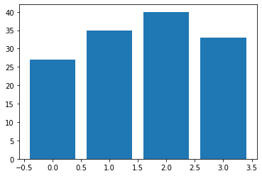
    


```python
plt.bar(index, before_ex, tick_label = member_IDs)
plt.show()
```


    
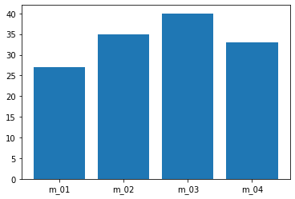
    


```python
colors=['r', 'g', 'b', 'm']
plt.bar(index, before_ex, color = colors, tick_label = member_IDs)
plt.show()
```


    
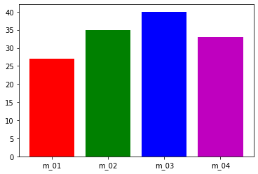
    


```python
plt.bar(index, before_ex, tick_label = member_IDs, width = 0.6)
plt.show()
```


    
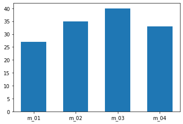
    


```python
colors=['r', 'g', 'b', 'm']
plt.barh(index, before_ex, color = colors, tick_label = member_IDs)
plt.show()
```


    
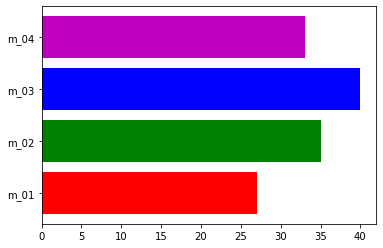
    


```python
barWidth = 0.4
plt.bar(index, before_ex, color='c', align='edge', width = barWidth, label='before')
plt.bar(index + barWidth, after_ex , color='m', align='edge', width = barWidth, label='after')

plt.xticks(index + barWidth, member_IDs)
plt.legend()
from matplotlib import font_manager, rc           #한글깨짐 방지하는 방법
font_path = "C:/Windows/Fonts/NGULIM.TTF"
font = font_manager.FontProperties(fname=font_path).get_name()
rc('font', family=font)
plt.xlabel('회원 ID')
plt.ylabel('윗몸일으키기 횟수')
plt.title('운동 시작 전과 후의 근지구력(복근) 변화 비교')
plt.show()
```


    
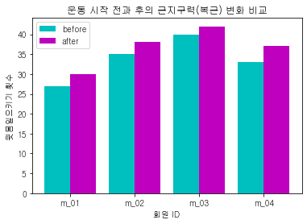
    


## histogram


```python
import matplotlib.pyplot as plt

math = [76, 82, 84, 83, 90, 86, 85, 92, 72, 71, 100, 87, 81, 76, 94, 78, 81, 60, 79, 69, 74, 87, 82, 68, 79]
plt.hist(math)
```


    (array([1., 0., 3., 2., 5., 5., 5., 1., 2., 1.]),
     array([ 60.,  64.,  68.,  72.,  76.,  80.,  84.,  88.,  92.,  96., 100.]),
     <BarContainer object of 10 artists>)


    
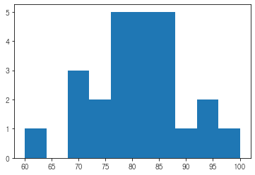
    


```python
plt.hist(math, bins= 8)
plt.show()
```


    
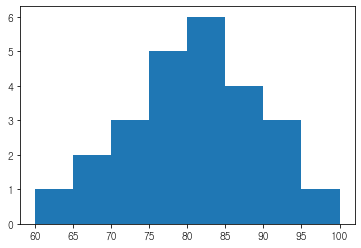
    


```python
plt.hist(math, bins= 8)
plt.xlabel('시험 점수')
plt.ylabel('도수(frequency)')
plt.title('수학 시험의 히스토그램')
plt.grid()
plt.show()
```


    
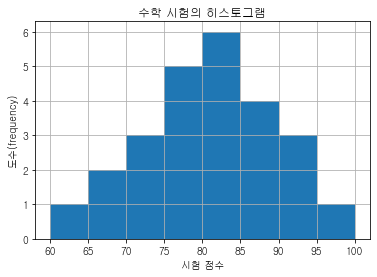
    


## PieGraph


```python
fruit = ['사과', '바나나', '딸기', '오렌지', '포도']
result = [7, 6, 3, 2, 2]
```


```python
import matplotlib.pyplot as plt

plt.pie(result)
plt.show()
```


    

    


```python
plt.figure(figsize=(5,5))
plt.pie(result)
plt.show()
```


    
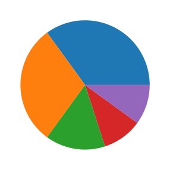
    


```python
plt.figure(figsize=(5,5))
plt.pie(result, labels= fruit, autopct='%.1f%%')
plt.show()
```


    
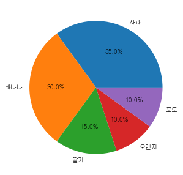
    


```python
plt.figure(figsize=(5,5))
plt.pie(result, labels= fruit, autopct='%.1f%%', startangle=90, counterclock = False)
plt.show()
```


    
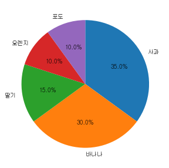
    


```python
explode_value = (0.1, 0, 0, 0, 0)

plt.figure(figsize=(5,5))
plt.pie(result, labels= fruit, autopct='%.1f%%', startangle=90, counterclock = False, explode=explode_value, shadow=True)
plt.show()
```


    
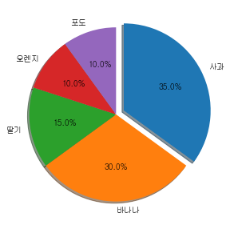
    


```python

```
