# data analysis matplotlib - 210616


```python
import numpy as np
import matplotlib.pyplot as plt
x = np.arange(0,5,1)
y1=x
y2=x+1
y3=x+2
y4=x+3
```


```python
plt.plot(x,y1,x,y2,x,y3,x,y4)
plt.show()
```


    [<matplotlib.lines.Line2D at 0x17e1ca41910>,
     <matplotlib.lines.Line2D at 0x17e1ca41790>,
     <matplotlib.lines.Line2D at 0x17e1ca41a60>,
     <matplotlib.lines.Line2D at 0x17e1ca41b20>]


    
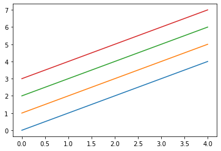
    


```python
plt.plot(x,y1,'m',x,y2,'y',x,y3,'k',x,y4,'c') #색바꾸기
plt.show()
```


    
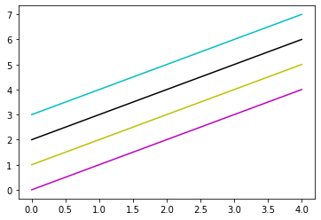
    


```python
plt.plot(x,y1,'-',x,y2,'--',x,y3,':',x,y4,'-.') #선 모양 바꾸기
plt.show()
```


    
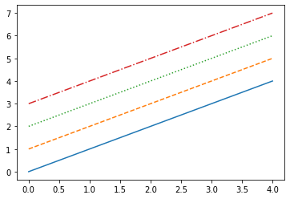
    


```python
plt.plot(x,y1,'o',x,y2,'^',x,y3,'s',x,y4,'d') # 지점 다양한 모양으로
plt.show()
```


    
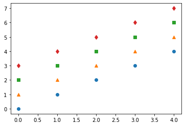
    


# 라벨,제목,격자,범례, 문자열 표시


```python
x= np.arange(-4.5,5,0.5)
y= 2*x**3

plt.plot(x,y)

from matplotlib import font_manager, rc           #한글깨짐 방지하는 방법
font_path = "C:/Windows/Fonts/NGULIM.TTF"
font = font_manager.FontProperties(fname=font_path).get_name()
rc('font', family=font)


plt.xlabel('김하연')
plt.ylabel('김하연2')

plt.show()
```


    
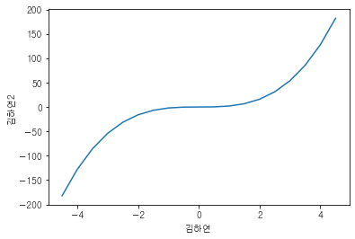
    


```python
plt.plot(x,y)
plt.xlabel('김김김')
plt.ylabel('김김김2')
plt.title('그래프그래프') # 타이틀 추가
plt.show()
```


    
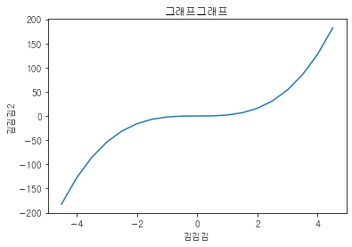
    


```python
plt.plot(x,y)
plt.xlabel('김김김')
plt.ylabel('김김김2')
plt.title('그래프그래프') # 타이틀 추가
plt.grid(True) #그리드 추가
plt.show()
```


    
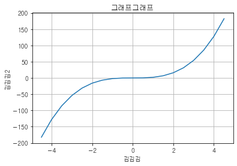
    


```python
x = np.arange(0,5,1)
y1=x
y2=x+1
y3=x+2
y4=x+3

plt.plot(x,y1,x,y2,x,y3,x,y4)
plt.legend(['data1','data2','data3','data4'])  #범례표시하는 방법, 아마 이전보다 간격을 좁게 표시하는 듯
plt.show
```


    <function matplotlib.pyplot.show(close=None, block=None)>


    
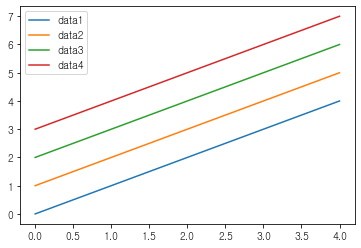
    


```python
plt.plot(x,y1,'>--r',x,y2,'s-g',x,y3,'d:b',x,y4,'-.Xc')
plt.legend(['data1','data2','data3','data4'],loc ='lower right')
plt.show()
```


    
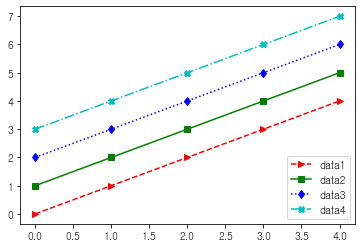
    


# 폰트변경하기


```python
import matplotlib
matplotlib.rcParams['font.family']
```


    ['New Gulim']


```python
matplotlib.rcParams['font.family']='Malgun Gothic'
matplotlib.rcParams['axes.unicode_minus']=False
```


```python
#테스트

plt.plot(x,y1,x,y2,x,y3,x,y4)
plt.legend(['데이터1','데이터2','데이터3','데이터4'],loc='lower right')
plt.xlabel('X축')
plt.ylabel('Y축')
plt.title('김하연')
plt.grid(True)
# plt.show()
```


    
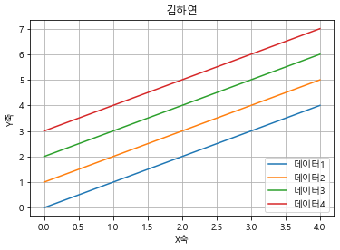
    


# 산점도


```python
height=[165,177,160,180,185,155,172]
weight=[62,67,55,74,90,43,64]

plt.scatter(height,weight)
plt.grid(True)
plt.xlabel('키')
plt.ylabel('몸무게')
plt.title('키와 몸무게의 상관관계')
plt.show()
```


    
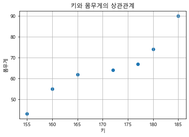
    


```python
plt.scatter(height,weight, s=500, c='r')   
plt.show()
#점 크기는 500,색깔은 레드
```


    
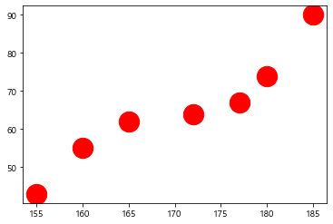
    


```python

```
