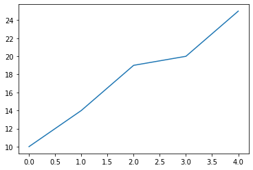
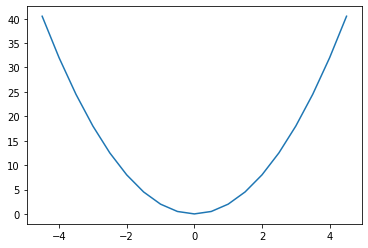
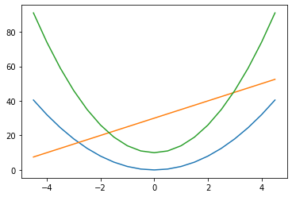
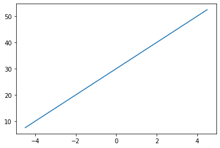
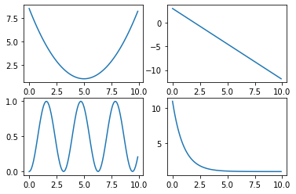
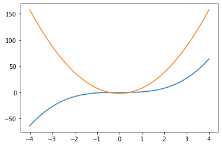
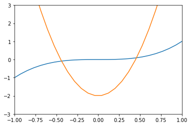

#  matplotlib


```python
import matplotlib.pyplot as plt
```


```python
data1=[10,14,19,20,25]
```


```python
plt.plot(data1)
```


    [<matplotlib.lines.Line2D at 0x2467f51d190>]


    

    


```python
%matplotlib qt
plt.plot(data1) #별도로 그래프 출력하기
```


    [<matplotlib.lines.Line2D at 0x2460683c2e0>]


```python
%matplotlib inline
```


```python
import numpy as np

x= np.arange(-4.5,5,0.5)
y=2*x**2
[x,y]
```


    [array([-4.5, -4. , -3.5, -3. , -2.5, -2. , -1.5, -1. , -0.5,  0. ,  0.5,
             1. ,  1.5,  2. ,  2.5,  3. ,  3.5,  4. ,  4.5]),
     array([40.5, 32. , 24.5, 18. , 12.5,  8. ,  4.5,  2. ,  0.5,  0. ,  0.5,
             2. ,  4.5,  8. , 12.5, 18. , 24.5, 32. , 40.5])]


```python
plt.plot(x,y)
plt.show()
```


    

    


그래프 여러개 그리는 방법


```python
import numpy as np            #세개의 그래프 그리기
x=np.arange(-4.5,5,0.5)
y1=2*x**2
y2=5*x+30
y3=4*x**2+10
```


```python
import matplotlib.pyplot as plt
```


```python
plt.plot(x,y1)
plt.plot(x,y2)
plt.plot(x,y3)
# plt.show()
```


    [<matplotlib.lines.Line2D at 0x24603eb2820>]


    

    


```python
plt.figure()
```


    <Figure size 432x288 with 0 Axes>


    <Figure size 432x288 with 0 Axes>


```python
plt.plot(x,y1)
plt.plot(x,y2)
plt.plot(x,y3)
# plt.show()
```


    [<matplotlib.lines.Line2D at 0x24603e43670>]


    

    


```python
plt.plot(x,y1)
plt.figure()
plt.plot(x,y2)
plt.show()
```


    

    


    

    


subplot 활용하기 (그래프 여러개로 나누기)


```python
import numpy as np
import matplotlib.pyplot as plt


x=np.arange(0,10,0.1)
y1=0.3*(x-5)**2+1
y2=-1.5*x+3
y3=np.sin(x)**2
y4=10*np.exp(-x)+1

plt.subplot(2,2,1)
plt.plot(x,y1)

plt.subplot(2,2,2)
plt.plot(x,y2)

plt.subplot(2,2,3)
plt.plot(x,y3)

plt.subplot(2,2,4)
plt.plot(x,y4)

plt.show()

```


    

    


원하는 부분 확대하기


```python
x=np.linspace(-4,4,100) 
y1=x**3
y2=10*x**2-2

plt.plot(x,y1,x,y2)
plt.show()
```


    

    


```python
plt.plot(x,y1,x,y2)
plt.xlim(-1,1)
plt.ylim(-3,3)
plt.show()
```


    

    


```python

```
